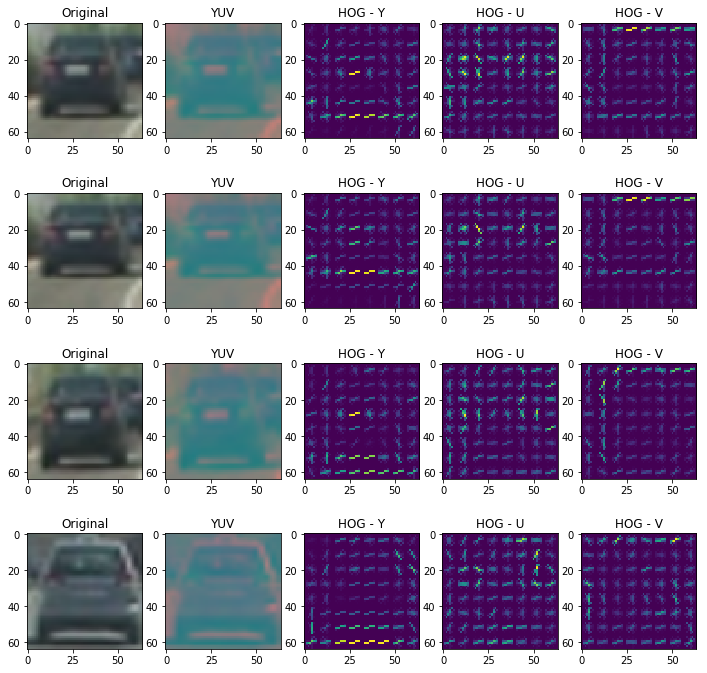
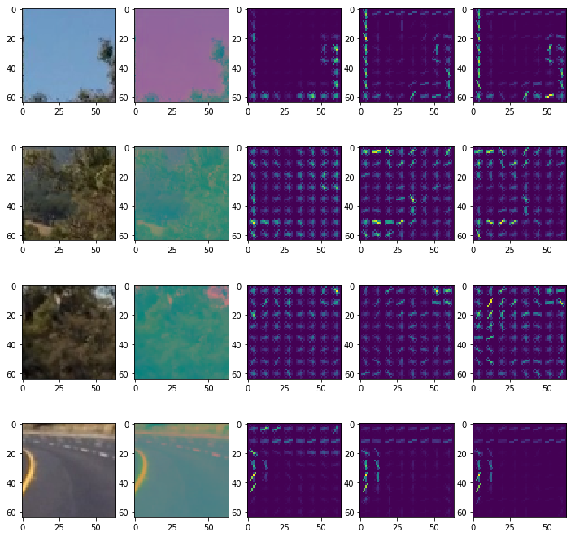
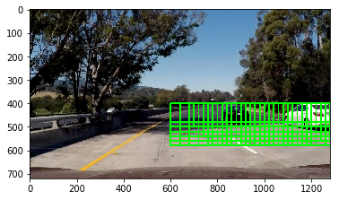

# Vehicle Detection Project

The goals / steps of this project are the following:
* Perform a Histogram of Oriented Gradients (HOG) feature extraction on a labeled training set of images and train a classifier Linear SVM classifier
* Optionally, you can also apply a color transform and append binned color features, as well as histograms of color, to your HOG feature vector.
Note: for those first two steps don't forget to normalize your features and randomize a selection for training and testing.
* Implement a sliding-window technique and use your trained classifier to search for vehicles in images.
* Run your pipeline on a video stream (start with the test_video.mp4 and later implement on full project_video.mp4) and create a heat map of recurring detections frame by frame to reject outliers and follow detected vehicles.
* Estimate a bounding box for vehicles detected.

### Documents included

* VehicleDetection-ModelTrain-YUV.ipynb
* VehicleDetection-Test-YUV.ipynb
* VehicleDetection-Writeup.md
* project_video_rbf-YUV.mp4


## Image Analysis

### Histogram of Oriented Gradients (HOG)

First step, I performed visual inspection on HOG transformation on various color spaces. After a complete analysis on all color spaces, I felt that 'Y' channel of YUV color space showed better pattern compared to other channels/color spaces. This inturn yielded better result as well. 

After many trials, I narrowed down to the below combination of parameters which produced better accuracy.
* orient = 9  # HOG orientations
* pix_per_cell = 8 # HOG pixels per cell
* cell_per_block = 2 # HOG cells per block
* hog_channel = 0 # Can be 0, 1, 2, or "ALL"
* spatial_size = (16, 16) # Spatial binning dimensions
* hist_bins = 9    # Number of histogram bins

Below is a display of the training images - Vehicle and Non Vehicle and corresponding HOG transformed values. 

```python
# Display Car Images
show_img(vehicle_img_dir)
```





```python
# Display Non Car Images
show_img(./images/non_vehicle_img_dir)
```





### Classifier Training

First, I started with the feature extraction. As decided earlier, I included the 'Y' channel only from YUV color space and retrieved the HOG features. 

Initially, I chose SVM Linear classifier as the model with 80-20 train-validation split and default 'C' parameter. This resulted in around 96% of Test accuracy. 

Later I attempted to include more features by adding the spatial and color histogram features along with the HOG features. Post training, the Test accuracy improved near 98%. 

Later, I tried changing the Kernel to RBF and it helped improving the Test accuracy above 98%.

### Sliding Window Search

Based on the visual inspection of the video, I arrived at few assumptions for this project (This is applicable only for this project video). 

* Only lower half of the image need to be scanned and also the small bottom portion of the image can be skipped.
* Left portion of the image can be skipped (NOTE: This is applicable only for the project video) inorder to reduce the scanning portion.
* Far vehicles require smaller window size and closer vehicles require larger window size. 

Based on the above assumption, I restricted the image scanning area and developed a logic to dynamically alter the window size as per variation with Y axis of the image. Total 96 windows were created in each scan.


```python
plt.imshow(draw_boxes(draw_image, windows, color=(0, 255, 0), thick=6))
```


    <matplotlib.image.AxesImage at 0x1e4003bebe0>





### Pipeline

Pipeline defintion involves various steps involving feature extraction, derive prediction on each sliding window defined and conclude the vehicle location. Following are the steps involved in the pipeline, given an image input.

* Transform the image into YUV color space.
* Extract features - spatial, color and HOG corresponding to Y channel
* Apply standard scaler
* Predict for each window extracted from the image
* Apply heat map on the predicted out
* Aggregate the heat map for last 3 images and use it for threshold application to avoid flickers
* Apply threshold on heat map to extract vehicle location and draw a box.

Below is the result from sample test images processed by pipeline. 


```python
img = mpimg.imread('test_images/test4.jpg')
plt.imshow(pipeline(img))
```


    <matplotlib.image.AxesImage at 0x1ec17f4e080>


Below is the result from sample test images showing heat map. 


```python
fig = plt.figure(figsize =(16*2,9*1))
plt.subplot(121)
plt.imshow(draw_img)
plt.title('Car Positions')
plt.subplot(122)
plt.imshow(heatmap, cmap='hot')
plt.title('Heat Map')
fig.tight_layout()

```


### Discussion

Other than the Y channel in YUV color space, I also tried with HSV/HSL/RGB color spaces. However, in all the outputs, one common observation was that there were many flickers in the image and many false positives. To tackle this, I added a averaging logic by which I accumulated hot windows detected in last n images and then perform the heat map threshold. This helped reducing the flicker. 

Few more improvements can be brought by fine tuning the model or approach with different algorithm. Additionally, I could try with HOG sub sampling approach other than sliding window approach to improve the performance.
